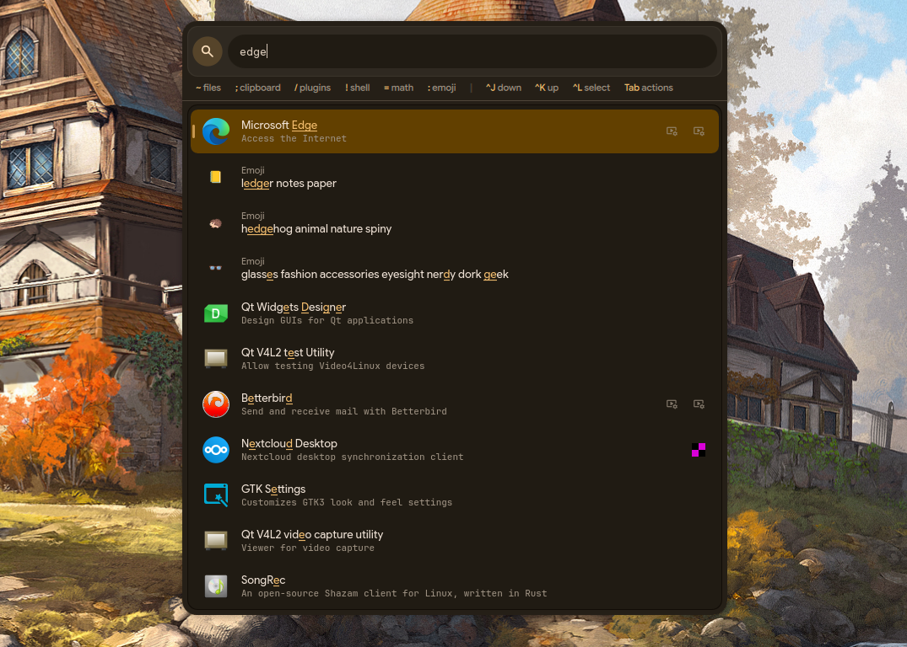
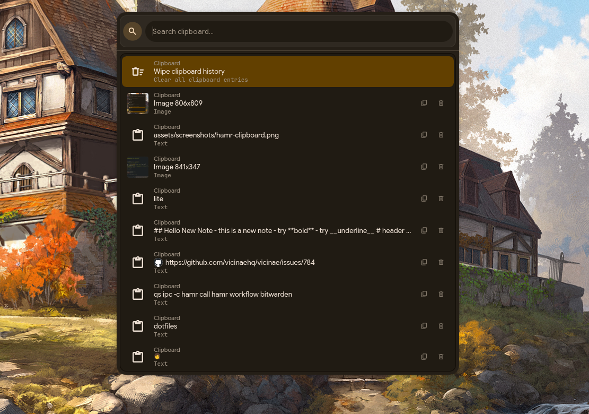

# Hamr

> "When all you have is a hammer, everything looks like a nail"

Hamr is an extensible launcher for Hyprland built with [Quickshell](https://quickshell.outfoxxed.me/). Extend it with plugins in any language using a simple JSON protocol.


## Screenshots


**Recent history at your fingertips** - Open Hamr to see your most-used plugins, shell commands, and actions ranked by frecency. Wallpaper thumbnails show exactly which wallpaper you set last time.


**Unified search across everything** - Apps, emojis, and more in one place. Fuzzy matching highlights what you're looking for, with app descriptions and running window indicators.


**Extensible plugin system** - Type `/` to browse all available plugins. From Bitwarden passwords to AI-powered plugin creation, each plugin communicates via simple JSON over stdin/stdout.


**Clipboard history with OCR search** - Type `;` to search your clipboard history. Images show thumbnails with OCR text extraction for searchable screenshots. Filter by type (Images/Text) and quick copy/delete actions.

## Platform Support

| Platform | Support | Notes |
|----------|---------|-------|
| **Hyprland** | Full | Primary target, all features work |
| **Other Wayland compositors** | Not supported | Would require significant refactoring (see below) |
| **X11** | Not supported | Quickshell is Wayland-only |
| **Windows / macOS** | Not supported | Quickshell is Linux-only; Wayland doesn't exist on these platforms |

<details>
<summary><strong>Why Hyprland-only?</strong></summary>

Hamr relies on Hyprland-specific APIs throughout its codebase:

| Component | Hyprland Dependency |
|-----------|---------------------|
| Focus management | `HyprlandFocusGrab` for keyboard/mouse capture |
| Monitor detection | `Hyprland.focusedMonitor`, `HyprlandMonitor` |
| Session tracking | `HYPRLAND_INSTANCE_SIGNATURE` environment variable |
| Keybindings | `bind = Super, Super_L, global, quickshell:hamrToggle` |

**Plugins also use Wayland-specific tools:**
- `wl-copy` / `wl-paste` for clipboard
- `cliphist` for clipboard history
- `grim` + `slurp` for screenshots
- `wf-recorder` for screen recording

Porting to other Wayland compositors (Sway, River, KDE Plasma) would require:
1. Replacing all `Quickshell.Hyprland` imports with compositor-agnostic alternatives
2. Implementing generic focus grabbing (no standard Wayland protocol exists)
3. Rewriting monitor detection logic
4. Updating keybind documentation for each compositor

This is a non-trivial effort and not currently planned.

</details>

Hamr is **fully standalone** and works out of the box on any Hyprland setup. It optionally integrates with [end-4's illogical-impulse](https://github.com/end-4/dots-hyprland) for enhanced theming features if detected.

## Credits

Hamr is extracted and adapted from [end-4's illogical-impulse](https://github.com/end-4/dots-hyprland). Major thanks to end-4 for the Material Design theming, fuzzy search, widget components, and overall architecture.

## Features

- **Frecency-based ranking** - Results sorted by frequency + recency (inspired by [zoxide](https://github.com/ajeetdsouza/zoxide))
- **Learned search affinity** - System learns your search shortcuts (type "q" to find QuickLinks if that's how you found it before)
- **Intent detection** - Auto-detects URLs, math expressions, currency, temperature, and commands
- **Fuzzy matching** - Fast, typo-tolerant search powered by [fuzzysort](https://github.com/farzher/fuzzysort), includes desktop entry keywords (e.g., "whatsapp" finds ZapZap)
- **Extensible plugins** - Language-agnostic handlers with simple JSON protocol (Python, Bash, Go, Rust, etc.)
- **History tracking** - Search, plugin actions, and shell command history
- **Draggable & persistent position** - Drag the launcher anywhere on screen; position remembered across sessions

### Prefix Shortcuts

| Prefix | Function | Prefix | Function |
|--------|----------|--------|----------|
| `~` | File search | `;` | Clipboard history |
| `/` | Actions & plugins | `!` | Shell history |
| `=` | Calculator | `:` | Emoji picker |

### Smart Calculator

Type math expressions directly - no prefix needed:

| Input | Output | Description |
|-------|--------|-------------|
| `2+2` | `4` | Basic math |
| `sqrt(16)` | `4` | Math functions |
| `10c` | `50 °F` | Temperature (Celsius to Fahrenheit) |
| `34f` | `1.11 °C` | Temperature (Fahrenheit to Celsius) |
| `$50` | `50 USD` | Currency symbol conversion |
| `S$100 to USD` | `$76.77` | Prefixed currency (SGD) |
| `sgd100` | `100 SGD` | Currency code (no space) |
| `VND 1,000,000` | `$38.06` | Thousand separators |
| `20% of 32` | `6.4` | Percentage calculations |
| `15% off 100` | `85` | Discount calculations |
| `10ft to m` | `3.048 m` | Unit conversion |
| `100 USD in EUR` | `€86.42` | Currency conversion |

Powered by [qalculate](https://qalculate.github.io/) - supports 150+ currencies with daily exchange rates (ECB), 100+ units, and advanced math. Run `qalc -e` to update rates.

### Built-in Plugins

| Plugin | Trigger | Description |
|--------|---------|-------------|
| `apps` | `/apps` | App drawer with categories (like rofi/dmenu) |
| `files` | `~` | File search with fd + fzf, thumbnails for images |
| `clipboard` | `;` | Clipboard history with OCR search, filter by type |
| `shell` | `!` | Shell command history (zsh/bash/fish) |
| `bitwarden` | `/bitwarden` | Password manager with local caching |
| `quicklinks` | `/quicklinks` | Web search with customizable quicklinks |
| `dict` | `/dict` | Dictionary lookup with definitions |
| `notes` | `/notes` | Quick notes with multi-line content support |
| `pictures` | `/pictures` | Browse images with thumbnails |
| `screenshot` | `/screenshot` | Browse screenshots with OCR text search |
| `screenrecord` | `/screenrecord` | Screen recording with auto-trim (wf-recorder) |
| `snippet` | `/snippet` | Text snippets for quick insertion |
| `todo` | `/todo` | Simple todo list manager |
| `wallpaper` | `/wallpaper` | Wallpaper selector (illogical-impulse) |
| `create-plugin` | `/create-plugin` | AI helper to create new plugins (requires [OpenCode](https://opencode.ai)) |
| `topcpu` | `/topcpu` | Process monitor sorted by CPU usage (auto-refresh) |
| `topmem` | `/topmem` | Process monitor sorted by memory usage (auto-refresh) |

### Simple Actions (Scripts)

| Action | Description |
|--------|-------------|
| `screenshot-snip` | Take screenshot with grim + satty |
| `dark` | Switch to dark mode (illogical-impulse) |
| `light` | Switch to light mode (illogical-impulse) |
| `accentcolor` | Set accent color (illogical-impulse) |

## Installation

### Arch Linux (Recommended)

```bash
# Clone the repository
git clone https://github.com/stewart86/hamr.git
cd hamr

# Run the install script (auto-installs dependencies)
./install.sh
```

The install script will:
- Check for missing dependencies and offer to install them via your AUR helper (paru, yay, etc.)
- Create a symlink at `~/.config/quickshell/hamr`
- Set up the user plugins directory at `~/.config/hamr/plugins/`

<details>
<summary><strong>What gets installed</strong></summary>

**Required dependencies:**
| Category | Packages |
|----------|----------|
| Core | `quickshell` >= 0.2.1 (or `quickshell-git`) |
| Python | `python`, `python-click`, `python-loguru`, `python-tqdm`, `python-gobject`, `gnome-desktop-4` |
| Clipboard | `wl-clipboard`, `cliphist` |
| File search | `fd`, `fzf` |
| Desktop | `xdg-utils`, `libnotify`, `gtk3`, `hyprland`, `libpulse`, `jq` |
| Calculator | `libqalculate` |
| Fonts | `ttf-material-symbols-variable`, `ttf-jetbrains-mono-nerd`, `ttf-readex-pro` |

**Optional dependencies:**
- `tesseract` - OCR for screenshot text search
- `imagemagick` - Alternative thumbnail generation
- `bitwarden-cli` - Bitwarden password manager plugin
- `slurp` - Screen region selection
- `wf-recorder` - Screen recording

</details>

<details>
<summary><strong>Manual dependency installation</strong></summary>

If you prefer to install dependencies manually:

```bash
# Using paru (or yay, etc.)
paru -S quickshell python python-click python-loguru python-tqdm \
    python-gobject gnome-desktop-4 wl-clipboard cliphist fd fzf \
    xdg-utils libnotify gtk3 hyprland libpulse jq libqalculate \
    ttf-material-symbols-variable ttf-jetbrains-mono-nerd ttf-readex-pro

# Optional
paru -S tesseract imagemagick bitwarden-cli slurp wf-recorder
```

</details>

### Other Distributions

<details>
<summary><strong>Fedora / Ubuntu / Debian</strong></summary>

Hamr requires [Quickshell](https://quickshell.outfoxxed.me/) which must be built from source on non-Arch distros. See the [Quickshell documentation](https://quickshell.outfoxxed.me/docs/getting-started/installation/) for build instructions.

Once Quickshell is installed, clone Hamr and install dependencies manually:

```bash
git clone https://github.com/stewart86/hamr.git
cd hamr

# Create config directories
mkdir -p ~/.config/quickshell ~/.config/hamr/plugins
ln -s "$(pwd)" ~/.config/quickshell/hamr

# Install Python dependencies
pip install click loguru tqdm PyGObject

# Install system packages (example for Fedora)
sudo dnf install fd-find fzf wl-clipboard jq qalculate

# Install fonts (see font section below)
```

</details>

<details>
<summary><strong>Font Installation (Non-Arch)</strong></summary>

| Font | Purpose |
|------|---------|
| **Material Symbols Rounded** | Icons throughout the UI |
| **JetBrains Mono NF** | Monospace text and Nerd Font icons |
| **Readex Pro** | Reading/content text |

Download from:
- [JetBrains Mono Nerd Font](https://github.com/ryanoasis/nerd-fonts/releases) - Download `JetBrainsMono.zip`
- [Material Symbols](https://github.com/google/material-design-icons/tree/master/variablefont)
- [Readex Pro](https://fonts.google.com/specimen/Readex+Pro)

```bash
mkdir -p ~/.local/share/fonts
# Extract/copy downloaded fonts to ~/.local/share/fonts/
fc-cache -fv
```

</details>

### Post-Installation Setup

**1. Add Hyprland keybinding (required)**

Hamr starts hidden and listens for a toggle signal. Add this to `~/.config/hypr/hyprland.conf`:

```bash
# Toggle Hamr with Super key (tap and release)
bind = Super, Super_L, global, quickshell:hamrToggle

# Or use Ctrl+Space instead
# bind = Ctrl, Space, global, quickshell:hamrToggle
```

**2. Start Hamr**

```bash
qs -c hamr
```

After starting, press your keybind (e.g., Super key) to open Hamr.

**3. (Optional) Auto-start with Hyprland**

Add to `~/.config/hypr/hyprland.conf`:
```bash
exec-once = qs -c hamr
```

### Updating

```bash
cd /path/to/hamr
./install.sh --update
```

### Uninstalling

```bash
./install.sh --uninstall
```

<details>
<summary><strong>Troubleshooting</strong></summary>

**"I ran `qs -c hamr` but nothing appears"**

This is expected. Hamr starts hidden and waits for a toggle signal. Make sure you:
1. Added the keybinding to `~/.config/hypr/hyprland.conf`
2. Reloaded Hyprland config: `hyprctl reload`
3. Press your keybind (e.g., Super key or Ctrl+Space)

**Check dependencies**

```bash
./install.sh --check
```

**View logs**

```bash
journalctl --user -u quickshell -f
```

**Warning about missing `colors.json`**

```
WARN: Read of colors.json failed: File does not exist
```

This is harmless. Hamr looks for Material theme colors from [illogical-impulse](https://github.com/end-4/dots-hyprland). Without it, Hamr uses built-in default colors.

**Warning about missing `quicklinks.json`**

```
WARN: Read of quicklinks.json failed: File does not exist
```

This is harmless. Quicklinks are optional. To add quicklinks, create `~/.config/hamr/quicklinks.json`:
```json
[
  {"name": "GitHub", "url": "https://github.com", "icon": "code"}
]
```

</details>

<details>
<summary><strong>Clipboard Support (Optional)</strong></summary>

```bash
# Install cliphist (Arch: pacman -S cliphist wl-clipboard)

# Add to Hyprland startup
exec-once = wl-paste --type text --watch cliphist store
exec-once = wl-paste --type image --watch cliphist store
```

</details>

<details>
<summary><strong>Theming</strong></summary>

Hamr uses Material Design colors for its UI. Colors can come from:

1. **Custom colors.json** - Set path in config: `"paths": {"colorsJson": "~/.config/hamr/colors.json"}`
2. **illogical-impulse** - Auto-detected from `~/.local/state/user/generated/colors.json`
3. **Built-in defaults** - Dark theme fallback when no colors.json found

**Creating a custom colors.json:**

The file should contain Material Design 3 color tokens. See [Material Theme Builder](https://material-foundation.github.io/material-theme-builder/) to generate a theme.

</details>

## Creating Plugins

Hamr loads plugins from two locations:
- **Built-in plugins**: `<hamr>/plugins/` - Included with Hamr, read-only
- **User plugins**: `~/.config/hamr/plugins/` - Your custom plugins

User plugins with the same name as built-in plugins will override them.

Each plugin is either:
- A **folder** with `manifest.json` + handler executable (multi-step plugins)
- An **executable script** (simple one-shot actions)

**Language agnostic:** Plugins communicate via JSON over stdin/stdout. Use Python, Bash, Go, Rust, Node.js - any language that can read/write JSON.

### What Plugins Can Do

| Capability | Description |
|------------|-------------|
| **Multi-step navigation** | Show lists, let users drill down, navigate back |
| **Rich cards** | Display markdown content (definitions, previews, help) |
| **Multi-field forms** | Forms with text, textarea, select, checkbox fields |
| **Image thumbnails** | Show image previews in result lists |
| **Action buttons** | Add context actions per item (copy, delete, open folder) |
| **Plugin action bar** | Toolbar buttons for plugin-level actions (Add, Wipe) with Ctrl+1-6 shortcuts |
| **Confirmation dialogs** | Inline confirmation for dangerous actions (e.g., "Wipe All") |
| **Image browser** | Full image browser UI with directory navigation |
| **OCR text search** | Search images by text content (requires tesseract) |
| **Execute commands** | Run any shell command, optionally save to history |
| **Custom placeholders** | Change search bar placeholder text per step |
| **Live search** | Filter results as user types |
| **Submit mode** | Wait for Enter before processing (for text input, chat) |
| **Auto-refresh polling** | Periodic updates for live data (process monitors, stats) |

<details>
<summary><strong>Quick Start: Hello World Plugin</strong></summary>

```bash
mkdir -p ~/.config/hamr/plugins/hello
```

**manifest.json:**
```json
{
  "name": "Hello World",
  "description": "A simple greeting plugin",
  "icon": "waving_hand"
}
```

**handler.py:**
```python
#!/usr/bin/env python3
import json
import sys

def main():
    input_data = json.load(sys.stdin)
    step = input_data.get("step", "initial")

    if step == "initial":
        print(json.dumps({
            "type": "results",
            "results": [
                {"id": "english", "name": "Hello!", "icon": "language"},
                {"id": "spanish", "name": "Hola!", "icon": "language"},
            ]
        }))
        return

    if step == "action":
        selected_id = input_data.get("selected", {}).get("id", "")
        print(json.dumps({
            "type": "card",
            "card": {
                "title": "Greeting",
                "content": f"You selected: {selected_id}",
                "markdown": True
            }
        }))

if __name__ == "__main__":
    main()
```

```bash
chmod +x ~/.config/hamr/plugins/hello/handler.py
```

Type `/hello` to try it!

</details>

<details>
<summary><strong>JSON Protocol Reference</strong></summary>

#### Input (stdin)

```json
{
  "step": "initial|search|action",
  "query": "user's search text",
  "selected": {"id": "selected-item-id"},
  "action": "action-button-id",
  "session": "unique-session-id"
}
```

#### Output (stdout)

**Show Results:**
```json
{
  "type": "results",
  "results": [
    {
      "id": "unique-id",
      "name": "Display Name",
      "description": "Optional subtitle",
      "icon": "material_icon_name",
      "thumbnail": "/path/to/image.png",
      "actions": [{"id": "copy", "name": "Copy", "icon": "content_copy"}]
    }
  ],
  "placeholder": "Custom placeholder...",
  "inputMode": "realtime",
  "pluginActions": [
    {"id": "add", "name": "Add", "icon": "add_circle"},
    {"id": "wipe", "name": "Wipe", "icon": "delete_sweep", "confirm": "Are you sure?"}
  ]
}
```

**Show Card:**
```json
{
  "type": "card",
  "card": {"title": "Title", "content": "Markdown **content**", "markdown": true}
}
```

**Execute Command:**
```json
{
  "type": "execute",
  "execute": {
    "command": ["xdg-open", "/path/to/file"],
    "name": "Open file.pdf",
    "close": true
  }
}
```

**Open Image Browser:**
```json
{
  "type": "imageBrowser",
  "imageBrowser": {
    "directory": "~/Pictures",
    "title": "Select Image",
    "enableOcr": true,
    "actions": [{"id": "set_wallpaper", "name": "Set Wallpaper", "icon": "wallpaper"}]
  }
}
```

Set `enableOcr: true` to enable background OCR indexing for text search within images (requires tesseract).

**Show Form (multi-field input):**
```json
{
  "type": "form",
  "form": {
    "title": "Add Note",
    "submitLabel": "Save",
    "fields": [
      {"id": "title", "type": "text", "label": "Title", "required": true},
      {"id": "content", "type": "textarea", "label": "Content", "rows": 6}
    ]
  },
  "context": "add_note"
}
```

Handler receives `{"step": "form", "formData": {"title": "...", "content": "..."}}` on submit.
Field types: `text`, `textarea`, `select`, `checkbox`, `password`. Keyboard: `Esc` cancel, `Ctrl+Enter` submit.

#### Input Modes

| Mode | Behavior | Use Case |
|------|----------|----------|
| `realtime` | Search on every keystroke (default) | Fuzzy filtering, file search |
| `submit` | Search only on Enter | Text input, AI chat, adding items |

Set `"inputMode": "submit"` in results/card response to wait for Enter.

#### Plugin Actions (Toolbar)

Add `pluginActions` to display toolbar buttons below the search bar. Useful for plugin-level operations like "Add", "Wipe All", "Refresh".

```json
"pluginActions": [
  {"id": "add", "name": "Add", "icon": "add_circle"},
  {"id": "wipe", "name": "Wipe All", "icon": "delete_sweep", "confirm": "Wipe all? This cannot be undone."}
]
```

- Keyboard shortcuts: Ctrl+1 through Ctrl+6
- Use `confirm` field for dangerous actions (shows inline confirmation dialog)
- Handler receives `{"step": "action", "selected": {"id": "__plugin__"}, "action": "add"}`

#### Polling (Auto-Refresh)

For live data (process monitors, stats), enable polling in `manifest.json`:

```json
{
  "name": "Top CPU",
  "icon": "speed",
  "poll": 2000
}
```

Handle `step: "poll"` in your handler (same format as `search`). Disable dynamically with `"pollInterval": 0` in response.

</details>

<details>
<summary><strong>Simple Actions (Scripts)</strong></summary>

For one-shot actions, create executable scripts directly:

```bash
#!/bin/bash
# ~/.config/hamr/plugins/screenshot
grim -g "$(slurp)" - | wl-copy
notify-send "Screenshot copied"
```

Appears in search as `/screenshot`.

</details>

## Smart Search: Learned Shortcuts

Hamr learns your search habits and creates automatic shortcuts. No configuration needed.

**How it works:**
1. Type "ff", scroll to "Firefox", press Enter
2. Next time you type "ff", Firefox appears at the top
3. The system remembers the last 5 search terms for each item

**Ranking algorithm:**
1. **Learned shortcuts first** - Items where you've used that exact search term before rank highest
2. **Frecency decides ties** - Among learned shortcuts, most frequently/recently used wins
3. **Fuzzy matches last** - Items that match but you haven't searched that way before

This means an item you use 10 times with "ff" will beat a command named "ff" that you've never executed.

**What's tracked:**
- Apps, actions, workflows, quicklinks
- URLs, workflow executions (wallpaper changes, file opens, etc.)
- Each item stores up to 5 recent search terms

**Example:**
```
Type "ff" → select Firefox → "ff" recorded
Type "ff" → select Firefox → frecency increased
Type "ff" → Firefox is now first (beats other "ff" matches you never use)

Type "wl" → select "Set wallpaper: sunset.jpg" → "wl" recorded
Type "wl" → wallpaper action appears first
```

Terms naturally age out based on frecency, so your shortcuts stay relevant as habits change.

## Configuration

Hamr is configured via `~/.config/hamr/config.json`. The install script creates a default config that you can customize. When updating, new config options are merged without overwriting your existing values.

<details>
<summary><strong>Full Configuration Reference</strong></summary>

```json
{
  "apps": {
    "terminal": "ghostty",
    "terminalArgs": "--class=floating.terminal",
    "shell": "zsh"
  },
  "search": {
    "nonAppResultDelay": 30,
    "debounceMs": 50,
    "pluginDebounceMs": 150,
    "maxHistoryItems": 500,
    "maxDisplayedResults": 16,
    "maxRecentItems": 20,
    "shellHistoryLimit": 50,
    "engineBaseUrl": "https://www.google.com/search?q=",
    "excludedSites": ["quora.com", "facebook.com"],
    "prefix": {
      "action": "/",
      "app": ">",
      "clipboard": ";",
      "emojis": ":",
      "file": "~",
      "math": "=",
      "shellCommand": "$",
      "shellHistory": "!",
      "webSearch": "?"
    },
    "shellHistory": {
      "enable": true,
      "shell": "auto",
      "customHistoryPath": "",
      "maxEntries": 500
    },
    "actionKeys": ["u", "i", "o", "p"]
  },
  "imageBrowser": {
    "useSystemFileDialog": false,
    "columns": 4,
    "cellAspectRatio": 1.333,
    "sidebarWidth": 140
  },
  "appearance": {
    "backgroundTransparency": 0.2,
    "contentTransparency": 0.2,
    "launcherXRatio": 0.5,
    "launcherYRatio": 0.1
  },
  "sizes": {
    "searchWidth": 580,
    "searchInputHeight": 40,
    "maxResultsHeight": 600,
    "resultIconSize": 40,
    "imageBrowserWidth": 1200,
    "imageBrowserHeight": 690,
    "windowPickerMaxWidth": 350,
    "windowPickerMaxHeight": 220
  },
  "fonts": {
    "main": "Google Sans Flex",
    "monospace": "JetBrains Mono NF",
    "reading": "Readex Pro",
    "icon": "Material Symbols Rounded"
  },
  "paths": {
    "wallpaperDir": "",
    "colorsJson": ""
  }
}
```

</details>

### Configuration Options

| Category | Option | Default | Description |
|----------|--------|---------|-------------|
| **Apps** | `terminal` | `ghostty` | Terminal emulator for shell commands |
| | `terminalArgs` | `--class=floating.terminal` | Arguments passed to terminal |
| | `shell` | `zsh` | Shell for command execution (zsh, bash, fish) |
| **Search** | `maxDisplayedResults` | `16` | Maximum results shown in launcher |
| | `maxRecentItems` | `20` | Recent history items on empty search |
| | `shellHistoryLimit` | `50` | Shell history results limit |
| | `debounceMs` | `50` | Search input debounce (ms) |
| | `pluginDebounceMs` | `150` | Plugin search debounce (ms) |
| **Appearance** | `backgroundTransparency` | `0.2` | Background transparency (0-1) |
| | `contentTransparency` | `0.2` | Content area transparency (0-1) |
| | `launcherXRatio` | `0.5` | Horizontal position (0=left, 1=right) |
| | `launcherYRatio` | `0.1` | Vertical position (0=top, 1=bottom) |
| **Sizes** | `searchWidth` | `580` | Search bar width (px) |
| | `searchInputHeight` | `40` | Search input height (px) |
| | `maxResultsHeight` | `600` | Max results container height (px) |
| | `resultIconSize` | `40` | Icon size in results (px) |
| | `imageBrowserWidth` | `1200` | Image browser width (px) |
| | `imageBrowserHeight` | `690` | Image browser height (px) |
| **Fonts** | `main` | `Google Sans Flex` | Main UI font |
| | `monospace` | `JetBrains Mono NF` | Monospace font |
| | `reading` | `Readex Pro` | Reading/content font |
| | `icon` | `Material Symbols Rounded` | Icon font |
| **Paths** | `wallpaperDir` | `""` | Custom wallpaper directory (empty = ~/Pictures/Wallpapers) |
| | `colorsJson` | `""` | Custom colors.json path (empty = illogical-impulse default) |

### Quick Examples

**Use a different terminal:**
```json
{
  "apps": {
    "terminal": "kitty",
    "terminalArgs": "--class floating",
    "shell": "fish"
  }
}
```

**More opaque launcher:**
```json
{
  "appearance": {
    "backgroundTransparency": 0.05,
    "contentTransparency": 0.1
  }
}
```

**Larger launcher:**
```json
{
  "sizes": {
    "searchWidth": 700,
    "maxResultsHeight": 800
  }
}
```

**Custom theme colors (without illogical-impulse):**
```json
{
  "paths": {
    "colorsJson": "~/.config/hamr/colors.json"
  }
}
```

<details>
<summary><strong>File Structure</strong></summary>

```
~/.config/quickshell/hamr/       # Symlink to cloned repo
├── shell.qml                    # Entry point
├── GlobalStates.qml             # UI state
├── plugins/                     # Built-in plugins (read-only)
├── modules/
│   ├── common/                  # Appearance, Config, widgets
│   ├── launcher/                # Launcher UI components
│   └── imageBrowser/            # Image browser UI
├── services/                    # LauncherSearch, PluginRunner, etc.
└── scripts/                     # Thumbnail generation, OCR indexing

~/.config/hamr/
├── plugins/                     # User plugins (override built-in)
├── config.json                  # User configuration
├── quicklinks.json              # Custom quicklinks
└── search-history.json          # Search history (auto-generated)
```

</details>

## Why Hamr?

### Comparison with Other Launchers

| | **Hamr** | **Vicinae** | **rofi/wofi** |
|---|---|---|---|
| **Plugin Language** | Any (Python, Bash, Go...) | TypeScript/React | Bash scripts |
| **Plugin Protocol** | Simple JSON stdin/stdout | Raycast-compatible SDK | Custom modes |
| **Linux Native** | Yes, built for Linux | Raycast shim layer | Yes |
| **Rich UI** | Cards, thumbnails, image browser | React components | Text-based |
| **Dependencies** | Quickshell only | Qt + Node.js runtime | Minimal |
| **Learning Curve** | ~10 min to first plugin | TypeScript + React knowledge | Script-based |

### Why Not Raycast Compatibility?

Launchers like [Vicinae](https://github.com/vicinaehq/vicinae) aim for Raycast extension compatibility, but this approach has limitations on Linux:

- **macOS-hardcoded paths** - Many Raycast extensions use paths like `~/Library/...` that don't exist on Linux ([example issue](https://github.com/vicinaehq/vicinae/issues/784))
- **macOS APIs** - Extensions often rely on macOS-specific APIs (AppleScript, Finder, Keychain)
- **Heavy runtime** - Requires Node.js + TypeScript toolchain for plugins

**Hamr takes a different approach:** plugins are native Linux scripts using a simple JSON protocol. Write in any language, use Linux-native tools (fd, fzf, wl-copy), and integrate with your existing dotfiles.

```python
# A complete Hamr plugin - no SDK, no build step
#!/usr/bin/env python3
import json, sys
print(json.dumps({"type": "results", "results": [{"id": "1", "name": "Hello"}]}))
```

This means browser bookmarks on Linux just read from `~/.config/google-chrome/Default/Bookmarks` directly - no compatibility layer needed.

### AI-Powered Raycast Conversion

Want functionality from a Raycast extension? Use the built-in `create-plugin` workflow:

```
/create-plugin
> Replicate this Raycast extension: https://github.com/raycast/extensions/tree/main/extensions/browser-bookmarks
```

The AI will analyze the Raycast extension, translate the patterns to Hamr's protocol, and create a native Linux plugin. See [`plugins/AGENTS.md`](plugins/AGENTS.md#converting-raycast-extensions) for the full conversion guide.

## License

This project is licensed under the **GNU General Public License v3.0** (GPL-3.0).

Hamr is a derivative work based on [end-4/dots-hyprland](https://github.com/end-4/dots-hyprland), which is also licensed under GPL-3.0. Major thanks to end-4 for the Material Design theming, fuzzy search, widget components, and overall architecture that made this project possible.

See the [LICENSE](LICENSE) file for the full license text.
